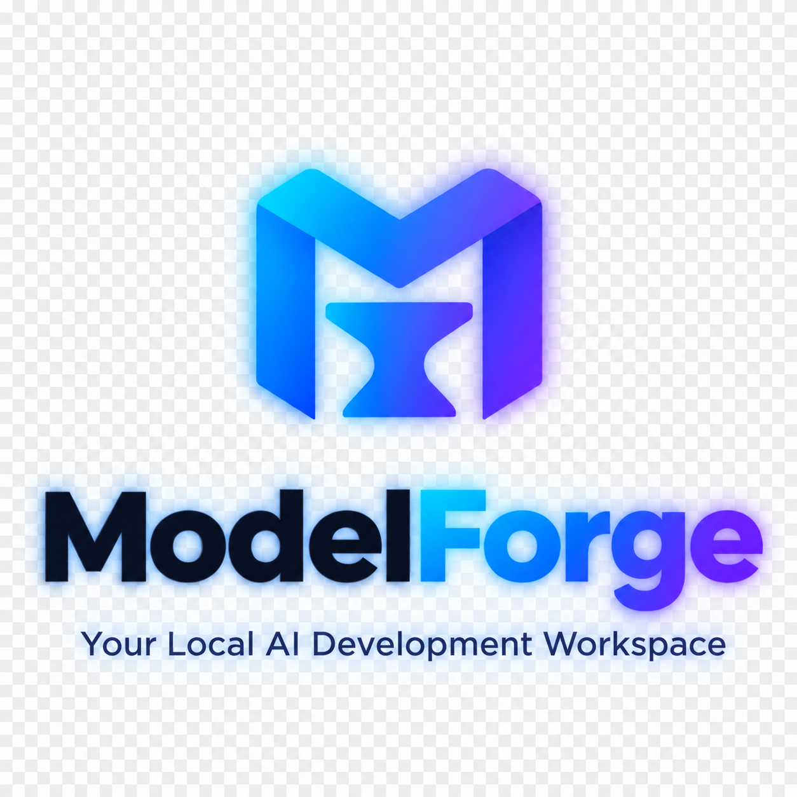
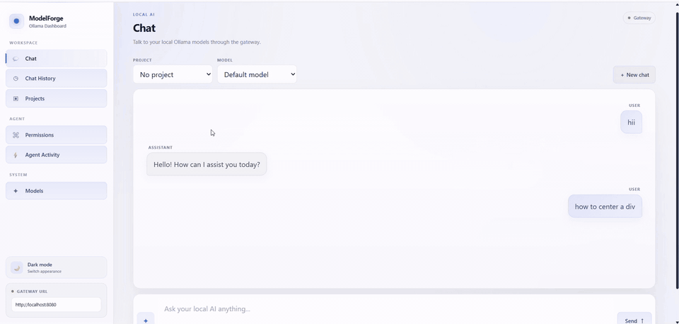

<div align="center">

<a href="https://github.com/">
  
</a>

# ModelForge

### Your Local AI Development Workspace

**Run local models. Build projects. Give agents controlled access to your files. Keep your data on your machine.**

<p>
  
  
  
  
  
</p>

<p>
  <a href="#-why-modelforge">Why ModelForge</a> ·
  <a href="#-features">Features</a> ·
  <a href="#-quickstart">Quickstart</a> ·
  <a href="#-architecture">Architecture</a> ·
  <a href="#-roadmap">Roadmap</a>
</p>

</div>

---

---
## 🧠 Why ModelForge?

ModelForge is a **self-hosted, local-first AI workspace** built around Ollama.

Instead of giving an AI agent unrestricted access to your machine, ModelForge puts a gateway between your client and local models. The gateway owns **conversation history, projects, permissions, model routing, and tool activity**.

The goal is simple:

> **Give local AI the context it needs — without giving it more access than it needs.**

It currently provides a working foundation that can be run locally today and expanded incrementally.

---

## ✨ Features

| Feature | What it does |
|---|---|
| 💬 **Persistent Chat** | Conversations are stored locally and can be continued later. |
| 🗂️ **Projects** | Organize conversations around individual repositories/workspaces. |
| 🤖 **Ollama Models** | Discover and chat with models available through your local Ollama instance. |
| 🛡️ **Permission Engine** | Decide whether agent tools should `ALLOW`, `DENY`, or `ASK` before execution. |
| 🧰 **Agent Runtime** | Node.js CLI that can call tools such as reading, writing, and listing files. |
| ⚡ **Agent Activity** | Keep an audit trail of tool calls and their results. |
| 💾 **Local Persistence** | H2 is the default database; PostgreSQL is supported through a Spring profile. |
| 🎨 **Dashboard** | Lightweight vanilla HTML/CSS/JS interface with no frontend build step. |
| 🐳 **Docker Support** | Run Ollama alone today or use the full Docker stack as the project grows. |

---

## 🏗️ Architecture

```text
                    ┌─────────────────────────┐
                    │       VS Code / CLI     │
                    │       / Dashboard       │
                    └────────────┬────────────┘
                                 │
                                 ▼
                    ┌─────────────────────────┐
                    │     Agent Runtime       │
                    │ context · tools · plan   │
                    │ file operations          │
                    └────────────┬────────────┘
                                 │
                                 ▼
              ┌─────────────────────────────────────┐
              │          ModelForge Gateway          │
              │                                     │
              │  API / Auth                         │
              │  Conversation Service              │
              │  Permission Engine                 │
              │  Model Router                      │
              └──────────────┬───────────┬──────────┘
                             │           │
                ┌────────────▼─────┐ ┌──▼───────────┐
                │   PostgreSQL /   │ │    Ollama    │
                │   H2 Persistence  │ │ Local Models │
                └──────────────────┘ └──────────────┘
                             ▲
                             │
                    ┌────────┴────────┐
                    │    Dashboard    │
                    │ chats · projects│
                    │ permissions     │
                    │ activity · models│
                    └─────────────────┘
```

### Current runtime path

For the minimal setup:

```text
Dashboard
    │
    ▼
Spring Boot Gateway
    │
    ├── H2 file database
    │
    └── Ollama API
```

No external database is required for the default development setup.

---

## 🚀 Quickstart

### Requirements

- Java 17+
- Maven
- Ollama
- Node.js 18+ if you want to use the agent runtime
- Python 3 if you want to serve the static dashboard locally

### 1. Start Ollama

Use a native Ollama installation:

```bash
ollama serve
```

Or start the project's minimal Ollama container:

```bash
docker compose up -d
```

Then pull a model:

```bash
ollama pull qwen2.5:7b
```

If Ollama is running inside Docker:

```bash
docker exec -it local-ai-ollama ollama pull qwen2.5:7b
```

### 2. Start the gateway

```bash
cd backend
mvn spring-boot:run
```

The gateway will be available at:

```text
http://localhost:8080
```

### 3. Start the dashboard

```bash
cd dashboard
python3 -m http.server 8081
```

Open:

```text
http://localhost:8081
```

That's it.

**Three processes. No database server. No frontend build step.**

---

## 🤖 Using the Agent Runtime

The Node.js CLI currently acts as the client-side agent runtime while the planned VS Code integration is being developed.

```bash
cd agent-runtime

npm install

GATEWAY_URL=http://localhost:8080 \
node agent.js \
  --workspace /path/to/your/repo \
  "list the files in src/"
```

Interactive mode:

```bash
node agent.js --workspace /path/to/your/repo
```

Then:

```text
> summarize what this repo does
```

### Permission flow

If a tool does not have an explicit permission rule, the runtime asks for approval:

```text
Tool requested: read_file
Permission: ASK

Allow this operation? [y/N]
```

You can configure tool behavior in the dashboard:

```text
ALLOW   → execute automatically
DENY    → reject automatically
ASK     → request approval
```

This is the core security idea behind ModelForge.

---

## 🛡️ Permissions

ModelForge is designed around the principle of **least privilege** for local AI agents.

For example:

```text
read_file       → ALLOW
list_dir        → ALLOW
write_file      → ASK
run_command     → DENY
```

The current permission engine supports rules at the tool/project level.

> **Important:** `pathScope` exists in the current permission model but is not yet enforced. Granular filesystem/path-based permission enforcement is part of the planned work.

---

## 💾 Data & Persistence

The default configuration uses **H2 as a file-based SQL database**.

Data is stored under:

```text
backend/data/
```

This means conversations persist across restarts without requiring PostgreSQL.

PostgreSQL is also wired up through the Spring `postgres` profile for a more scalable setup.

### PostgreSQL

```bash
docker compose -f docker-compose.full.yml up -d postgres

cd backend

mvn spring-boot:run \
  -Dspring-boot.run.profiles=postgres
```

The PostgreSQL connection can be overridden with:

```text
DB_HOST
DB_PORT
DB_NAME
DB_USER
DB_PASSWORD
```

---

## 📁 Project Structure

```text
ModelForge/
├── docker-compose.yml
├── docker-compose.full.yml
├── .env.example
├── backend/
│   ├── pom.xml
│   └── src/main/java/com/localai/gateway/
│       ├── GatewayApplication.java
│       ├── config/
│       ├── controller/
│       ├── service/
│       ├── repository/
│       ├── model/
│       └── dto/
│
├── dashboard/
│   ├── index.html
│   ├── app.js
│   └── styles.css
│
└── agent-runtime/
    ├── package.json
    └── agent.js
```

### Backend layers

```text
controller/
    REST API

service/
    Conversation Service
    Permission Service
    Model Router
    Ollama Client

repository/
    Spring Data JPA

model/
    Project
    Conversation
    Message
    Permission
    ToolEvent

dto/
    API request / response models
```

The backend structure intentionally mirrors the architecture.

---

## 🔌 API

Current API surface:

| Method | Endpoint | Purpose |
|---|---|---|
| `POST` | `/api/chat` | Send a message and receive a model reply |
| `GET` | `/api/conversations` | List conversations |
| `GET` | `/api/conversations/{id}` | Open a conversation |
| `DELETE` | `/api/conversations/{id}` | Delete a conversation |
| `GET` | `/api/projects` | List projects |
| `POST` | `/api/projects` | Create a project |
| `PUT` | `/api/projects/{id}` | Update a project |
| `DELETE` | `/api/projects/{id}` | Delete a project |
| `GET` | `/api/permissions` | List permission rules |
| `POST` | `/api/permissions` | Create a permission rule |
| `PUT` | `/api/permissions/{id}` | Update a permission |
| `DELETE` | `/api/permissions/{id}` | Delete a permission |
| `GET` | `/api/permissions/check` | Check a tool permission |
| `GET` | `/api/tool-events` | List agent/tool activity |
| `POST` | `/api/tool-events` | Record a tool event |
| `PUT` | `/api/tool-events/{id}` | Update a tool event |
| `GET` | `/api/models` | List models available in Ollama |

---

## 🧭 Daily Workflow

A typical workflow looks like this:

1. Start Ollama.
2. Start the ModelForge gateway.
3. Open the dashboard.
4. Create a project for the repository you're working on.
5. Select its default model and workspace path.
6. Configure tool permissions.
7. Chat with your local model.
8. Use the CLI agent runtime when file/tool access is needed.
9. Review **Agent Activity** to see what tools were called and what happened.

---

## 🗺️ Roadmap

ModelForge is intentionally being built incrementally.

### 🔥 Near-term

- [ ] Streaming responses with SSE/WebSockets
- [ ] Gateway authentication
- [ ] Structured Ollama function/tool calling
- [ ] Model-generated conversation titles
- [ ] Better dashboard UX
- [ ] More robust error handling

### 🧠 Agent capabilities

- [ ] Granular filesystem/path permissions
- [ ] Sandboxed `run_command`
- [ ] `apply_patch` / `git_diff`
- [ ] Approval queue in the dashboard
- [ ] Search codebase tool
- [ ] More agent tools
- [ ] Model fallback chains

### 🔎 Knowledge

- [ ] PostgreSQL + `pgvector`
- [ ] Local embeddings
- [ ] RAG over project codebases
- [ ] Conversation search
- [ ] Prompt template library

### 🧩 Integrations

- [ ] VS Code extension
- [ ] Real editor context
- [ ] Workspace-aware agent sessions

### 📊 Observability

- [ ] Token usage
- [ ] Latency metrics
- [ ] Model comparison dashboard
- [ ] Better agent execution logs
- [ ] Export conversations to Markdown

---

## 🔐 Security Notes

ModelForge is currently a **local development tool**, not a production-ready multi-user platform.

Important current limitations:

- The gateway does not yet have authentication.
- Anything that can reach the gateway may be able to call its API.
- `pathScope` is present in the data model but is not currently enforced.
- The agent tool loop currently needs a maximum-turns guard.
- H2 is intended as a simple development database rather than a concurrent production datastore.
- Before exposing the gateway beyond your local machine, add authentication and review the tool permission model carefully.

These limitations are documented intentionally so the project can evolve toward a safer architecture rather than hiding the current boundaries.

---

## 🤝 Contributing

ModelForge is still early, so contributions, ideas, testing, and feedback are especially useful.

Good areas to contribute:

```text
🛡️ Permission enforcement
🤖 Agent tooling
🔌 Ollama integration
🎨 Dashboard UX
🧠 RAG / code search
🧩 VS Code integration
📊 Observability
📚 Documentation
🧪 Tests
```

If you're new to the project, look for issues labeled:

```text
good first issue
help wanted
```

---

## ⭐ Support the Project

If ModelForge is useful to you:

-  Star the repository
-  Report bugs
-  Suggest features
-  Submit improvements
-  Share it with other local-AI developers

Every star and contribution helps the project grow.

---

##  License

Add your project's chosen open-source license here.

If you plan to publish ModelForge publicly, adding a real `LICENSE` file is recommended before the first major release.

---

<div align="center">

### ModelForge

**Local models. Real projects. Controlled agents.**

Built for developers who want AI that runs where their code lives.

</div>
